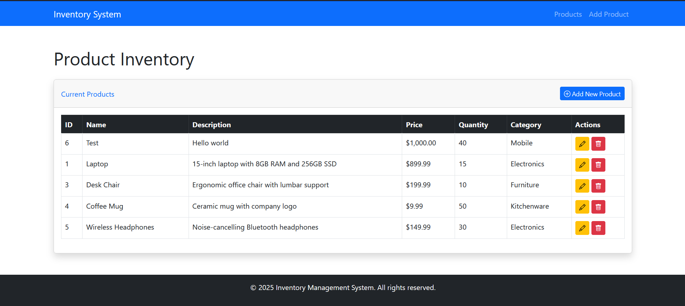
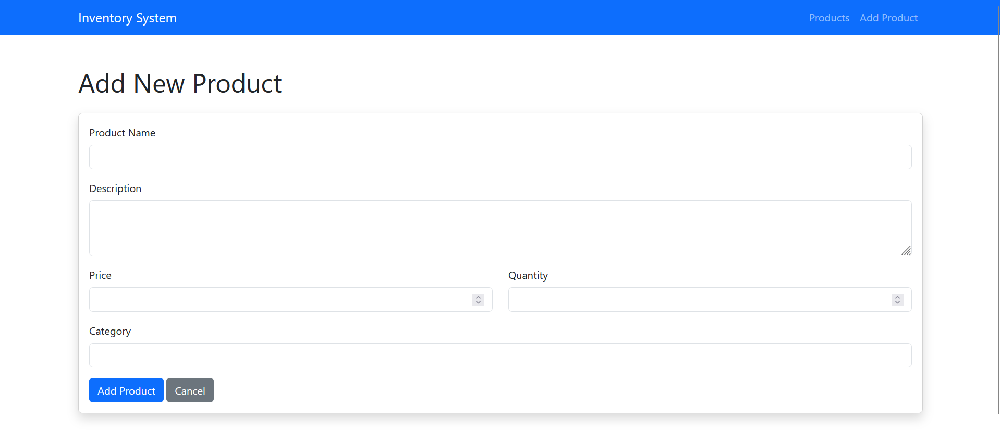
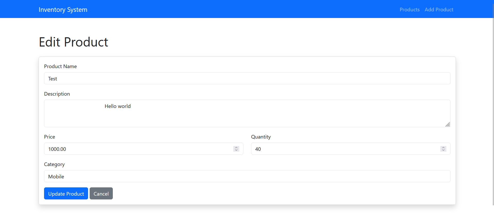

# 📦 Inventory Management System (IMS)

A web-based inventory management system built with PHP and MySQL, allowing users to manage products efficiently.

 <!-- REPLACE WITH ACTUAL SCREENSHOT PATH -->

## ✨ Features
- **Add Products** - Create new inventory items with details.
- **Edit Products** - Modify existing product information.
- **Delete Products** - Remove items from inventory.
- **Dashboard Overview** - View all products in a clean interface.
- **Modular Codebase** - Organized with reusable components.

---

## 🖥️ Screenshots

### Dashboard
<!-- PASTE DASHBOARD SCREENSHOT HERE -->
 <!-- EXAMPLE: Replace with actual path -->

### Add Product Form
<!-- PASTE ADD PRODUCT FORM SCREENSHOT HERE -->

### Edit Product Interface
<!-- PASTE EDIT INTERFACE SCREENSHOT HERE -->

---

## 🛠️ Technologies
- **Backend**: PHP
- **Frontend**: HTML, CSS, JavaScript
- **Database**: MySQL
- **Server**: XAMPP/Apache

---

## 🚀 Installation
1. **Clone the repository**:
   ```bash
   git clone https://github.com/your-username/IMS.git
